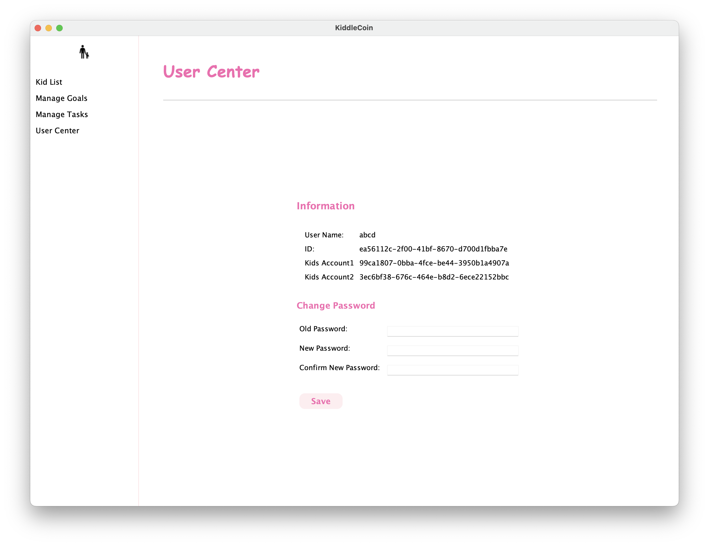

# KiddleCoin
EBU6304 – Software Engineering Group Project: A Virtual Bank Application for Kids - developing the software using Agile Methods

## Overview

KiddleCoin is a comprehensive financial education application designed to help children learn about money management under the supervision of their parents. The application provides a secure and interactive platform where children can manage their savings, set financial goals, and complete tasks to earn rewards, while parents can monitor and guide their financial activities.

### Features

- **Account Management**: Supports both child and parent accounts, each with specific functionalities.
- **Data Persistence**: Ensures all account data, transactions, tasks, and goals are securely saved and retrievable from a JSON file.
- **Task and Goal Management**: Allows children to create and track tasks and saving goals, providing a hands-on way to learn about financial planning.
- **Transaction History**: Maintains a detailed log of all transactions for both child and parent accounts, ensuring transparency and traceability.
- **User Interface**: Offers a user-friendly interface for both children and parents to interact with the application seamlessly.

## Quick Start

### Launch

We highly recommend users to use **IDEA** to configure and launch this project.

We use **Maven** to manage  Java environment. Users need to load Maven through [`pom.xml`](https://github.com/IcyFish332/KiddleCoin/blob/main/pom.xml) first.

For IDEA users, you can just run `Main.java` to launch the project.

For others, you should compile all java files and run `Main.java` to launch the project.

### Register and Login

Registration must be done for every new user. Click `Create an account` button to do so. Remember to choose right account type.

Then you can login with your username and password. Right account type is also needed.

### Enjoy:tada:

Now you enjoy KiddleCoin!!​

